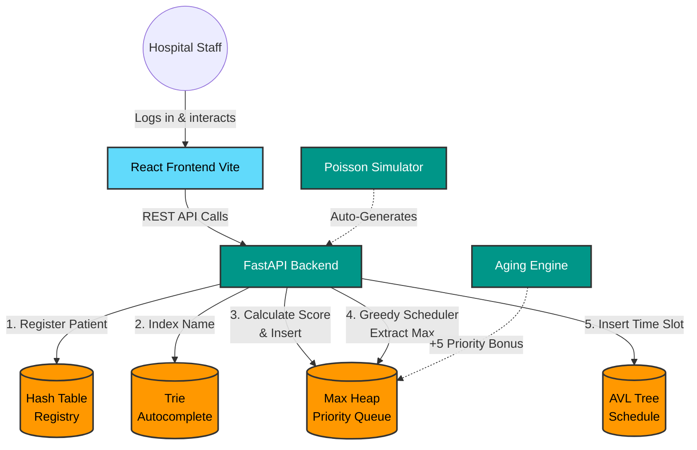

<p align="center">
  
  
  
  
  
</p>

<h1 align="center">🏥 MediQueue</h1>
<p align="center"><strong>Emergency-Aware Hospital Scheduling System</strong></p>
<p align="center">
  A full-stack healthcare scheduling platform powered entirely by custom-built data structures for real-time patient triage, greedy scheduling, and fairness analysis.
</p>
<p align="center"><em>Course Project — Data Structures & Algorithmic Analysis (DSAA) · SY IoT Sem 4</em></p>

---

## 📋 Table of Contents

- [Overview](#-overview)
- [Tech Stack](#-tech-stack)
- [System Workflow — How to Use](#-system-workflow--how-to-use)
- [Core Functions Under the Hood](#-core-functions-under-the-hood)
- [Architecture & Flow Chart](#-architecture--flow-chart)
- [Features & Data Structures](#-features--data-structures)
- [Time Complexity Summary](#-time-complexity-summary)
- [Algorithm Details](#-algorithm-details)
- [Getting Started](#-getting-started)
- [Login Credentials](#-login-credentials)
- [Running Tests](#-running-tests)
- [Project Structure](#-project-structure)
- [API Reference](#-api-reference)
- [License](#-license)

---

## 🔍 Overview

MediQueue is an **emergency-aware hospital scheduling system** designed to optimise patient throughput in emergency departments. Instead of relying on a traditional database, the entire data layer is built on **four custom data structures** — all hand-implemented in Python without external libraries:

| # | Data Structure | Role | Key Advantage |
|---|----------------|------|---------------|
| 1 | **Max Heap** | Priority Queue / Triage | O(1) peek at highest-priority patient |
| 2 | **AVL Tree** | Appointment Schedule | O(log n) balanced slot lookup & insertion |
| 3 | **Hash Table** | Patient Registry | O(1) average-case ID lookups |
| 4 | **Trie** | Name Autocomplete | O(k) prefix search (k = query length) |

### What It Does

- **Real-time triage** — Composite priority scoring (urgency + age bonus + wait-time aging)
- **Greedy scheduling** — Optimal 15-minute appointment slot assignment
- **Poisson arrival simulation** — Stress-test the system with configurable arrival rates
- **Strategy comparison** — Head-to-head Pure Urgency vs. Aging-Based fairness analysis with Jain's Fairness Index
- **Anti-starvation aging** — Low-priority patients automatically gain +5 priority per 10 minutes waited

---

## 🧰 Tech Stack

| Layer | Technology | Version |
|-------|-----------|---------|
| **Backend** | Python + FastAPI | 3.10+ / 0.115 |
| **ASGI Server** | Uvicorn | 0.30 |
| **Validation** | Pydantic | 2.9 |
| **Background Jobs** | APScheduler | 3.10 |
| **Frontend** | React | 19 |
| **Build Tool** | Vite | 8 |
| **Styling** | Tailwind CSS | 4 |
| **Charts** | Recharts | 3.8 |
| **HTTP Client** | Axios | 1.15 |
| **Routing** | React Router DOM | 7.14 |

---

## 🔄 System Workflow — How to Use

Follow this sequence to properly demonstrate the full system:

### Step 1 — Login & Authentication
Use the provided staff credentials (e.g. `doctor@mediqueue.org` / `admin@123`) to access the dashboard. All routes beyond the landing page are protected.

### Step 2 — Register Patients
Navigate to the **Register** tab. Enter patient details (name, age, emergency type, urgency level). The system automatically computes a **composite priority score** = `urgency_base + age_bonus` and inserts the patient into the Max Heap, Hash Table, and Trie simultaneously.

### Step 3 — Run a Simulation
Go to the **Simulation** tab. Configure the arrival rate (patients/min) and duration, then start. The backend spawns a background thread generating patients at **Poisson-distributed** intervals — mimicking real hospital arrivals.

### Step 4 — Monitor the Dashboard
Switch to the **Dashboard** (auto-refreshes every 2 seconds). Watch the queue populate in real-time. The "Live Activity Log" tracks every arrival. Click **"Process Next Patient"** to extract the highest-priority patient from the Max Heap (`O(1)` peek, `O(log n)` extraction). A **voice announcement** is automatically triggered via the browser's Web Speech API, calling the current patient to their assigned room and alerting the next patient to get ready.

### Step 5 — Run the Greedy Scheduler
Navigate to the **Scheduler** tab and click **"Generate Optimal Schedule"**. The Greedy Algorithm extracts every patient from the Heap (highest-priority first) and assigns them 15-minute slots via the AVL Tree.

### Step 6 — Compare Scheduling Strategies
Open the **Comparison** tab. Run a side-by-side analysis of:
- **Strategy A** — Pure Urgency (no aging bonus)
- **Strategy B** — Aging-Based (wait-time bonus applied)

Compare metrics: Jain's Fairness Index, starvation count, max wait time, and throughput.

### Step 7 — Patient Lookup
Use the **Lookup** tab to search by patient ID (Hash Table `O(1)`) or by name prefix (Trie autocomplete `O(k)`).

---

## ⚙️ Core Functions Under the Hood

### 1. Patient Registration & Triage
When a patient is registered, the system calculates a composite **Priority Score** = `urgency_base + age_bonus + wait_time_bonus`. The patient is inserted into:
- **Max Heap** — for priority-based extraction ( $O(\log n)$ insertion )
- **Hash Table** — for instant ID lookups ( $O(1)$ average )
- **Trie** — for name autocomplete ( $O(k)$ insertion, $k$ = name length )

### 2. Greedy Scheduler (Dynamic Slot Allocation)
The scheduler repeatedly:
1. **Extracts** the max element from the Heap (most urgent patient)
2. **Searches** the AVL Tree for the earliest available 15-minute gap
3. **Inserts** the appointment into the AVL Tree (self-balancing, $O(\log n)$)
4. Repeats until the Heap is empty

### 3. Anti-Starvation (Priority Aging)
To prevent low-urgency patients from waiting indefinitely, an aging function runs periodically. Every **10 simulation-minutes**, all queued patients receive a **+5 priority bonus**. The Heap is updated in-place so older patients naturally bubble up toward extraction.

### 4. Patient Search (Autocomplete)
Typing a name prefix in the Lookup tab traverses the custom **Trie (Prefix Tree)**, returning all matching patient IDs in $O(k)$ time without scanning the entire registry.

### 5. Poisson Arrival Simulation
The simulation engine generates patients at exponentially distributed inter-arrival times:
```
interval = -ln(1 - U) / λ     where U ~ Uniform(0,1), λ = arrival rate
```
Time is compressed: **1 real second = 1 simulation minute**. A special **Starvation Mode** (80% Critical) is available to stress-test fairness.

### 6. Voice Announcement (Web Speech API)
When a staff member clicks **"Process Next Patient"** on the Dashboard, the browser speaks an announcement aloud using the **Web Speech API** (`SpeechSynthesisUtterance`):

```
"Patient <name>, please go to room number <N>.
 Patient <next_name>, please be ready."
```

- A **random room number** (1–5) is assigned to the current patient.
- The **next-in-queue** patient is alerted to prepare.
- The system attempts to use an **Indian English (en-IN)** voice for natural pronunciation of patient names.
- Speech rate and pitch are fine-tuned (`rate: 0.82`, `pitch: 1.1`) for clarity in hospital environments.

---

## 🏗 Architecture & Flow Chart

MediQueue follows a decoupled **Client-Server** architecture. The React frontend communicates with the FastAPI backend entirely through RESTful APIs.

### ASCII Architecture Diagram
```text
+-------------------+       REST API       +-----------------------+
|                   |  <===============>   |                       |
|  REACT FRONTEND   |                      |    FASTAPI BACKEND    |
|   (Vite + UI)     |                      |  (Controller Layer)   |
|                   |                      |                       |
+--------+----------+                      +-----------+-----------+
         |                                             |
         | (User Input)                                | (Data Processing)
         v                                             v
+-------------------+                      +-----------------------+
|  Hospital Staff   |                      |   IN-MEMORY STORAGE   |
|  (Doctor/Admin)   |                      |  (Data Structures)    |
+-------------------+                      +-----------------------+
                                             |       |       |
                 +---------------------------+       |       +----------------------------+
                 |                                   |                                    |
                 v                                   v                                    v
         +---------------+                   +---------------+                    +---------------+
         |  HASH TABLE   |                   |   MAX HEAP    |                    |   AVL TREE    |
         | (O(1) Lookup) |                   |  (Triage/PQ)  |                    | (Scheduling)  |
         +---------------+                   +---------------+                    +---------------+
                 |                                   ^                                    ^
                 v                                   |                                    |
         +---------------+                   +-------+-------+                    +-------+-------+
         |     TRIE      |                   | Aging Engine  |                    | Greedy Alg.   |
         | (Search Auto) |                   | (+5 Priority) |                    | (Assign Slots)|
         +---------------+                   +---------------+                    +---------------+
```

### Mermaid Flow Chart



### Architecture Layers

| # | Layer | Responsibility |
|---|-------|---------------|
| 1 | **Presentation** (React + Vite + Tailwind CSS) | UI rendering, state management, protected routes, data visualization (Recharts) |
| 2 | **Controller** (FastAPI) | REST endpoints, request validation (Pydantic), background task coordination |
| 3 | **Data** (In-Memory Structures) | Core engine — four custom-built data structures replacing a traditional database |

---

## ✨ Features & Data Structures

| Module | Description | Data Structure(s) |
|--------|-------------|-------------------|
| **Dashboard** | Real-time queue monitoring with live activity log, auto-refresh every 2s | Max Heap |
| **Register Patient** | Composite priority scoring with urgency + age + wait bonuses | Max Heap + Hash Table + Trie |
| **Greedy Scheduler** | Optimal 15-min slot allocation using greedy algorithm | Max Heap → AVL Tree |
| **Arrival Simulation** | Poisson-distributed patient generator with configurable rate/duration | Max Heap |
| **Starvation Scenario** | 80% Critical flood to demonstrate fairness degradation | Max Heap |
| **Strategy Comparison** | Head-to-head Pure Urgency vs Aging-Based fairness analysis | Full pipeline (cloned Heap + AVL) |
| **Patient Lookup** | O(1) ID search + Trie prefix autocomplete | Hash Table + Trie |
| **Priority Aging** | +5 priority bonus per 10 minutes waiting (anti-starvation) | Max Heap rebuild |
| **Voice Announcement** | Browser-based TTS announces current & upcoming patient on processing | Web Speech API |

---

## ⏱ Time Complexity Summary

| Operation | Data Structure | Time Complexity |
|-----------|---------------|-----------------|
| Insert patient into queue | Max Heap | O(log n) |
| Peek at highest priority | Max Heap | O(1) |
| Extract max (process next) | Max Heap | O(log n) |
| Update priority (aging) | Max Heap | O(n) search + O(log n) heapify |
| Remove by ID | Max Heap | O(n) search + O(log n) heapify |
| Register patient (lookup) | Hash Table | O(1) average |
| Search patient by ID | Hash Table | O(1) average |
| Delete patient | Hash Table | O(1) average |
| Insert appointment slot | AVL Tree | O(log n) |
| Search for available slot | AVL Tree | O(log n) |
| In-order traversal (schedule) | AVL Tree | O(n) |
| Delete appointment | AVL Tree | O(log n) |
| Insert name for autocomplete | Trie | O(k), k = name length |
| Prefix search | Trie | O(k + m), m = matches |
| Delete name | Trie | O(k) |
| **Greedy schedule (full run)** | Heap + AVL | **O(n log n)** |

---

## 🧮 Algorithm Details

### Priority Score Computation
```
priority_score = urgency_base + age_bonus + wait_time_bonus

Where:
  urgency_base = { Critical: 100, High: 75, Medium: 50, Low: 25 }
  age_bonus    = 10 (if age > 60, else 0)
  wait_bonus   = floor(wait_minutes / 10) × 5
```

### Greedy Scheduling Algorithm
```
function GreedySchedule(Heap, AVL):
    while Heap is not empty:
        patient ← Heap.ExtractMax()               // O(log n)
        slot    ← AVL.FindNextAvailable(0, 15)     // O(log n)
        appt    ← CreateAppointment(patient, slot)
        AVL.Insert(appt)                           // O(log n)
    return AVL.InOrder()                           // O(n) sorted schedule
```
**Total: O(n log n)** for n patients.

### Jain's Fairness Index
```
J(x₁, x₂, ..., xₙ) = (Σxᵢ)² / (n × Σxᵢ²)

Where xᵢ = (wait_time + 1) for patient i
Range: 1/n (worst) to 1.0 (perfect fairness)
```

### Poisson Arrival Model
```
inter_arrival_time = -ln(1 - U) / λ

Where:
  U ~ Uniform(0, 1)
  λ = configured arrival rate (patients per minute)
```

### Strategy Comparison Scoring
Both strategies run on an identical cloned patient set. The winner is determined by a weighted points system:

| Metric | Weight | Better = |
|--------|--------|----------|
| Fairness Index | 2 pts | Higher |
| Starvation Count | 2 pts | Lower |
| Max Wait Time | 1 pt | Lower |

---

## 🚀 Getting Started

### Prerequisites

- **Python 3.10+** installed
- **Node.js 18+** and **npm** installed
- **Git** installed

### 1. Clone the Repository

```bash
git clone https://github.com/Prathamesh-Patil-git/MediQueue.git
cd MediQueue
```

### 2. Backend Setup

```bash
# From the project root (MediQueue/)

# Create virtual environment
python -m venv venv

# Activate virtual environment
# Windows (PowerShell):
.\venv\Scripts\Activate.ps1
# Windows (CMD):
venv\Scripts\activate.bat
# macOS/Linux:
source venv/bin/activate

# Install dependencies
pip install -r requirements.txt

# Start the backend server
uvicorn backend.main:app --reload --port 8000
```

The API will be available at `http://localhost:8000`.  
Interactive Swagger docs at `http://localhost:8000/docs`.

### 3. Frontend Setup

Open a **new terminal window**:

```bash
cd frontend

# Install dependencies
npm install

# Start the dev server
npm run dev
```

The frontend will be available at `http://localhost:5173`.

> **Note:** The Vite dev server proxies `/api` requests to the backend automatically (configured in `vite.config.js`).

---

## 🔑 Login Credentials

> **This is a demo application.** Authentication is session-based — credentials are validated client-side against hardcoded user accounts. All dashboard routes are protected and require login.

### Available User Accounts

| # | Hospital ID | Email | Password | Role |
|---|-------------|-------|----------|------|
| 1 | `HOSP-001-01` | `doctor@mediqueue.org` | `admin@123` | Triage Supervisor |
| 2 | `HOSP-001-02` | `nurse@mediqueue.org` | `nurse@123` | Head Nurse |
| 3 | `HOSP-001-03` | `admin@mediqueue.org` | `superadmin@123` | System Administrator |

---

## 🧪 Running Tests

### Data Structure Tests

Validates all four custom data structures (Max Heap, Hash Table, AVL Tree, Trie):

```bash
python test_structures.py
```

**Tests cover:** insert, extract, peek, update priority, remove by ID, resize, search, in-order traversal, find next available slot, prefix search, delete.

### Engine Integration Tests

Validates the scheduler, simulation engine, and comparison engine working together:

```bash
python test_engines.py
```

**Tests cover:** patient generation, aging pass, greedy scheduling, fairness index computation, strategy comparison winner determination.

---

## 📁 Project Structure

```
MediQueue/
├── backend/
│   ├── structures/              # Custom data structures (from scratch)
│   │   ├── max_heap.py          # Binary Max Heap — priority queue
│   │   ├── avl_tree.py          # Self-balancing AVL Tree — scheduling
│   │   ├── hash_table.py        # Chained Hash Table — patient registry
│   │   └── trie.py              # Prefix Trie — name autocomplete
│   ├── main.py                  # FastAPI app + all REST endpoints
│   ├── models.py                # Pydantic models + urgency levels
│   ├── scheduler.py             # Greedy scheduling + aging logic
│   ├── simulation.py            # Poisson arrival simulation engine
│   ├── comparison.py            # Strategy A vs B comparison engine
│   └── state.py                 # Global in-memory application state
├── frontend/
│   ├── src/
│   │   ├── pages/               # Route-level page components
│   │   │   ├── Home.jsx         # Landing page
│   │   │   ├── Login.jsx        # Authentication page
│   │   │   ├── Dashboard.jsx    # Real-time queue monitor
│   │   │   ├── Register.jsx     # Patient registration form
│   │   │   ├── Scheduler.jsx    # Greedy scheduler UI
│   │   │   ├── Simulation.jsx   # Arrival simulation controls
│   │   │   ├── Comparison.jsx   # Strategy A vs B analysis
│   │   │   ├── Lookup.jsx       # Patient search (ID + autocomplete)
│   │   │   └── NotFound.jsx     # 404 page
│   │   ├── components/          # Reusable UI components
│   │   │   ├── Navbar.jsx       # Top navigation bar
│   │   │   ├── Sidebar.jsx      # Side navigation panel
│   │   │   ├── QueueTable.jsx   # Priority queue table
│   │   │   ├── StatsBar.jsx     # Statistics summary bar
│   │   │   ├── FairnessGauge.jsx# Fairness index visualizer
│   │   │   └── UrgencyBadge.jsx # Colored urgency label
│   │   ├── context/
│   │   │   └── AuthContext.jsx  # Authentication context provider
│   │   ├── api/
│   │   │   └── api.js           # Axios API client
│   │   ├── App.jsx              # Root layout + routing
│   │   ├── main.jsx             # React entry point
│   │   └── index.css            # Design system tokens + global styles
│   ├── package.json             # Frontend dependencies
│   └── vite.config.js           # Vite config + API proxy
├── test_structures.py           # Data structure unit tests
├── test_engines.py              # Engine integration tests
├── requirements.txt             # Python dependencies
├── .gitignore
└── README.md                    # This file
```

---

## 📡 API Reference

All endpoints are served on `http://localhost:8000`. Interactive docs available at `/docs`.

### Patient APIs

| Method | Endpoint | Description |
|--------|----------|-------------|
| `POST` | `/patient/register` | Register a new patient → inserts into Heap + Hash Table + Trie |
| `GET` | `/patient/{id}` | Lookup by patient ID — Hash Table O(1) |
| `DELETE` | `/patient/{id}` | Remove patient from all data structures |
| `GET` | `/patient/search/{prefix}` | Trie prefix autocomplete search |

### Queue APIs

| Method | Endpoint | Description |
|--------|----------|-------------|
| `GET` | `/queue` | Get priority-sorted queue (all patients) |
| `GET` | `/queue/next` | Peek at highest priority patient — O(1) |
| `POST` | `/queue/process` | Extract max from heap (process next patient) |
| `PUT` | `/queue/age` | Trigger one priority aging pass (+5 to all) |

### Scheduler APIs

| Method | Endpoint | Description |
|--------|----------|-------------|
| `POST` | `/schedule/run` | Run greedy scheduling on current queue |
| `GET` | `/schedule` | Get full schedule — AVL in-order traversal |
| `GET` | `/schedule/stats` | Get metrics from last scheduling run |

### Simulation APIs

| Method | Endpoint | Description |
|--------|----------|-------------|
| `POST` | `/simulation/start` | Start Poisson arrival simulation |
| `POST` | `/simulation/stop` | Stop running simulation |
| `GET` | `/simulation/status` | Get simulation status & patient count |
| `POST` | `/simulation/starvation` | Start starvation scenario (80% Critical) |

### Comparison APIs

| Method | Endpoint | Description |
|--------|----------|-------------|
| `POST` | `/compare` | Run Strategy A vs B on same patient set |
| `GET` | `/compare/result` | Get last comparison result |

### Utility APIs

| Method | Endpoint | Description |
|--------|----------|-------------|
| `GET` | `/logs` | Activity log (last 200 events) |
| `POST` | `/reset` | Reset all data structures & state |
| `GET` | `/health` | Health check (queue/registry/schedule sizes) |

---

## 📄 License

This project is developed as an academic course project for the **Data Structures & Algorithmic Analysis (DSAA)** module under the SY IoT programme.

---

<p align="center">
  <strong>Built with ❤️ using custom data structures — no external DS libraries used</strong><br/>
  <em>Max Heap · AVL Tree · Hash Table · Trie</em>
</p>
