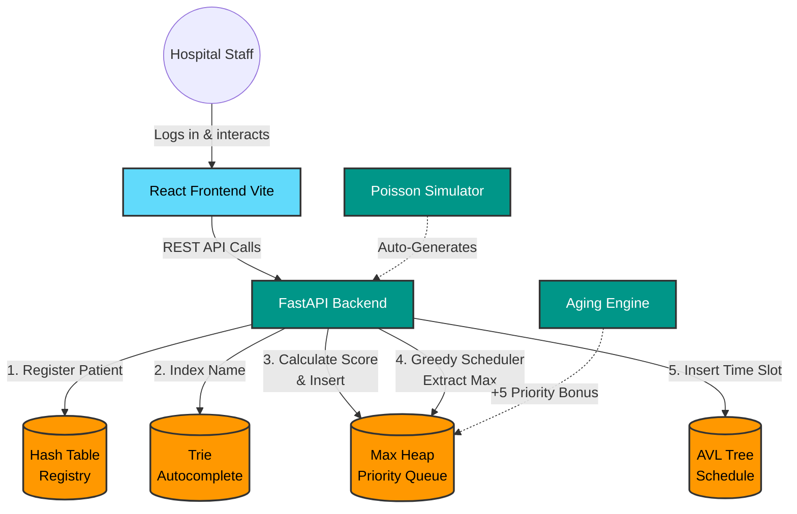

<p align="center">
  
  
  
  
</p>

<h1 align="center">🏥 MediQueue</h1>
<p align="center"><strong>Emergency-Aware Hospital Scheduling System</strong></p>
<p align="center">
  A full-stack healthcare scheduling platform built on custom data structures for real-time patient triage, greedy scheduling, and fairness analysis.
</p>
<p align="center"><em>DSAA Course Project — Group 39 — SY IoT, Semester 4</em></p>

---

## 📋 Table of Contents

- [Overview](#-overview)
- [How It Works (System Workflow)](#-how-it-works-system-workflow)
- [Project Architecture & Flow Chart](#-project-architecture--flow-chart)
- [Features & Data Structures](#-features--data-structures)
- [Getting Started](#-getting-started)
- [Login Credentials](#-login-credentials)
- [Algorithm Details](#-algorithm-details)
- [Project Structure](#-project-structure)
- [API Reference](#-api-reference)

---

## 🔍 Overview

MediQueue is an emergency-aware hospital scheduling system designed to optimize patient throughput in emergency departments. It uses a **Max Heap** for priority-based triage, an **AVL Tree** for balanced appointment scheduling, a **Hash Table** for O(1) patient lookup, and a **Trie** for real-time name autocomplete — all implemented from scratch in Python without external data structure libraries.

The platform provides:
- **Real-time triage** with composite priority scoring
- **Greedy scheduling algorithm** for 15-minute appointment slots
- **Poisson-distributed arrival simulation** for stress testing
- **Strategy comparison** (Pure Urgency vs Aging-Based) with Jain's Fairness Index
- **Anti-starvation aging mechanism** to prevent indefinite waiting

---

## 🔄 How It Works (System Workflow)

To properly perform and test the system, follow this sequence:

1. **Login & Authentication**: Use the provided staff credentials (e.g., `doctor@mediqueue.org`) to log securely into the dashboard.
2. **Register Patients**: Head to the **Register** tab. Manually enter patient details. Notice how the system automatically calculates a composite priority score based on age and emergency urgency.
3. **Run the Simulation**: Go to the **Simulation** tab to simulate a real hospital environment. Set the arrival rate (e.g., 5 patients/min) and start the simulation. The backend will use Poisson distribution to flood the system with random patients.
4. **Monitor the Dashboard**: Switch to the **Dashboard**. Watch the queue fill up in real-time. Notice the "Live Activity Log" tracking arrivals. Click "Process Next Patient" to extract the highest-priority patient (O(1) peek, O(log n) extract from the Max Heap).
5. **Run the Scheduler**: Navigate to the **Scheduler** tab and click "Generate Optimal Schedule". The Greedy Algorithm will pop everyone out of the queue and insert them into the AVL Tree, assigning perfect 15-minute slots based on priority.
6. **Compare Fairness**: Finally, go to the **Comparison** tab. Run a side-by-side analysis of "Pure Urgency" vs "Aging-Based" scheduling to see how the mathematical aging bonus solves patient starvation and improves Jain's Fairness Index.

---

## 🏗 Project Architecture & Flow Chart

MediQueue follows a decoupled Client-Server architecture. The React frontend interacts with the FastAPI backend entirely through RESTful APIs, ensuring modularity.

### ASCII Architecture Diagram
```text
+-------------------+       REST API       +-----------------------+
|                   |  <===============>   |                       |
|  REACT FRONTEND   |                      |    FASTAPI BACKEND    |
|   (Vite + UI)     |                      |  (Controller Layer)   |
|                   |                      |                       |
+--------+----------+                      +-----------+-----------+
         |                                             |
         | (User Input)                                | (Data Processing)
         v                                             v
+-------------------+                      +-----------------------+
|  Hospital Staff   |                      |   IN-MEMORY STORAGE   |
|  (Doctor/Admin)   |                      |  (Data Structures)    |
+-------------------+                      +-----------------------+
                                             |       |       |
                 +---------------------------+       |       +----------------------------+
                 |                                   |                                    |
                 v                                   v                                    v
         +---------------+                   +---------------+                    +---------------+
         |  HASH TABLE   |                   |   MAX HEAP    |                    |   AVL TREE    |
         | (O(1) Lookup) |                   |  (Triage/PQ)  |                    | (Scheduling)  |
         +---------------+                   +---------------+                    +---------------+
                 |                                   ^                                    ^
                 v                                   |                                    |
         +---------------+                   +-------+-------+                    +-------+-------+
         |     TRIE      |                   | Aging Engine  |                    | Greedy Alg.   |
         | (Search Auto) |                   | (+5 Priority) |                    | (Assign Slots)|
         +---------------+                   +---------------+                    +---------------+
```

### Mermaid Flow Chart



### Architecture Components:
1. **Presentation Layer (React)**: Handles state management, protected routes, and data visualization (Recharts).
2. **Controller Layer (FastAPI)**: Exposes endpoints, handles request validation via Pydantic, and coordinates background tasks.
3. **Data Layer (In-Memory DS)**: The core engine. Instead of a traditional SQL database, MediQueue maintains global state across four custom-built, highly-optimized data structures.

---

## ✨ Features & Data Structures

| Module | Description | Data Structure |
|--------|-------------|----------------|
| **Dashboard** | Real-time queue monitoring with live activity log, auto-refresh every 2s | Max Heap |
| **Register Patient** | Composite priority scoring with urgency + age + wait bonuses | Max Heap + Hash Table + Trie |
| **Greedy Scheduler** | Optimal 15-min slot allocation using greedy algorithm | AVL Tree |
| **Arrival Simulation** | Poisson-distributed patient generator with configurable rate/duration | Max Heap |
| **Strategy Comparison** | Head-to-head Pure Urgency vs Aging-Based fairness analysis | Full pipeline |
| **Patient Lookup** | O(1) ID search + Trie prefix autocomplete | Hash Table + Trie |
| **Priority Aging** | +5 priority bonus per 10 minutes waiting | Max Heap rebuild |

---

## 🚀 Getting Started

### Prerequisites

- **Python 3.10+** installed
- **Node.js 18+** and **npm** installed
- **Git** installed

### 1. Clone the Repository

```bash
git clone https://github.com/Prathamesh-Patil-git/MediQueue.git
cd MediQueue
```

### 2. Backend Setup

```bash
# Create virtual environment
python -m venv venv

# Activate virtual environment
# Windows:
venv\Scripts\activate
# macOS/Linux:
source venv/bin/activate

# Install dependencies
pip install -r requirements.txt

# Start the backend server
uvicorn backend.main:app --reload --port 8000
```

The API will be available at `http://localhost:8000`.  
Interactive docs at `http://localhost:8000/docs`.

### 3. Frontend Setup

Open a new terminal window:

```bash
cd frontend

# Install dependencies
npm install

# Start the dev server
npm run dev
```

The frontend will be available at `http://localhost:5173`.

---

## 🔑 Login Credentials

> **This is a demo application.** Authentication is session-based — credentials are validated client-side against hardcoded user accounts. All dashboard routes are protected and require login.

### Available User Accounts

| # | Hospital ID | Email | Password | Role |
|---|-------------|-------|----------|------|
| 1 | `HOSP-001-01` | `doctor@mediqueue.org` | `admin@123` | Triage Supervisor |
| 2 | `HOSP-001-02` | `nurse@mediqueue.org` | `nurse@123` | Head Nurse |
| 3 | `HOSP-001-03` | `admin@mediqueue.org` | `superadmin@123` | System Administrator |

---

## 🧮 Algorithm Details

### Priority Score Computation
```
priority_score = urgency_base + age_bonus + wait_time_bonus

Where:
  urgency_base = { Critical: 100, High: 75, Medium: 50, Low: 25 }
  age_bonus    = 10 (if age > 60, else 0)
  wait_bonus   = floor(wait_minutes / 10) × 5
```

### Greedy Scheduling
1. Extract all patients from the Max Heap (sorted by priority).
2. Assign 15-minute slots sequentially starting from time 0.
3. Insert each appointment into the AVL Tree (keyed by start time).
4. Compute fairness metrics: max wait, Jain's Fairness Index, starvation count.

### Jain's Fairness Index
```
J(x₁, x₂, ..., xₙ) = (Σxᵢ)² / (n × Σxᵢ²)

Where xᵢ = normalized wait time for patient i
Range: 1/n (worst) to 1.0 (perfect fairness)
```

---

## 📁 Project Structure

```
MediQueue/
├── backend/
│   ├── structures/           # Custom data structures (from scratch)
│   │   ├── max_heap.py       # Priority queue
│   │   ├── avl_tree.py       # Balanced BST for scheduling
│   │   ├── hash_table.py     # Patient registry
│   │   └── trie.py           # Name autocomplete
│   ├── main.py               # FastAPI app + all REST endpoints
│   ├── models.py             # Pydantic models + urgency levels
│   ├── scheduler.py          # Greedy scheduling + aging logic
│   ├── simulation.py         # Poisson arrival simulation engine
│   ├── comparison.py         # Strategy A vs B comparison
│   └── state.py              # Global application state
├── frontend/
│   ├── src/
│   │   ├── components/       # Reusable UI components
│   │   ├── pages/            # Route-level page components
│   │   ├── api/api.js        # Axios API client
│   │   ├── App.jsx           # Root layout + routing
│   │   └── index.css         # Design system tokens + global styles
├── requirements.txt          # Python dependencies
└── README.md                 # This file
```

---

## 📡 API Reference

### Patient APIs
| Method | Endpoint | Description |
|--------|----------|-------------|
| `POST` | `/patient/register` | Register a new patient |
| `GET` | `/patient/{id}` | Lookup by ID (Hash Table O(1)) |
| `DELETE` | `/patient/{id}` | Remove patient |
| `GET` | `/patient/search/{prefix}` | Trie autocomplete search |

### Queue APIs
| Method | Endpoint | Description |
|--------|----------|-------------|
| `GET` | `/queue` | Get priority-sorted queue |
| `GET` | `/queue/next` | Peek at highest priority |
| `POST` | `/queue/process` | Extract max from heap |
| `PUT` | `/queue/age` | Trigger priority aging pass |

### Scheduler APIs
| Method | Endpoint | Description |
|--------|----------|-------------|
| `POST` | `/schedule/run` | Run greedy scheduling |
| `GET` | `/schedule` | Get full schedule (AVL in-order) |
| `GET` | `/schedule/stats` | Get scheduling metrics |

### Simulation APIs
| Method | Endpoint | Description |
|--------|----------|-------------|
| `POST` | `/simulation/start` | Start Poisson simulation |
| `POST` | `/simulation/stop` | Stop simulation |
| `GET` | `/simulation/status` | Get simulation status |
| `POST` | `/simulation/starvation` | Start starvation scenario |

### Comparison APIs
| Method | Endpoint | Description |
|--------|----------|-------------|
| `POST` | `/compare` | Run A vs B comparison |
| `GET` | `/compare/result` | Get last comparison |

### Utility APIs
| Method | Endpoint | Description |
|--------|----------|-------------|
| `GET` | `/logs` | Activity log (last 200) |
| `POST` | `/reset` | Reset all state |
| `GET` | `/health` | Health check |

---

<p align="center">
  <strong>Built with ❤️ using custom data structures</strong><br/>
  <em>Max Heap · AVL Tree · Hash Table · Trie</em>
</p>
